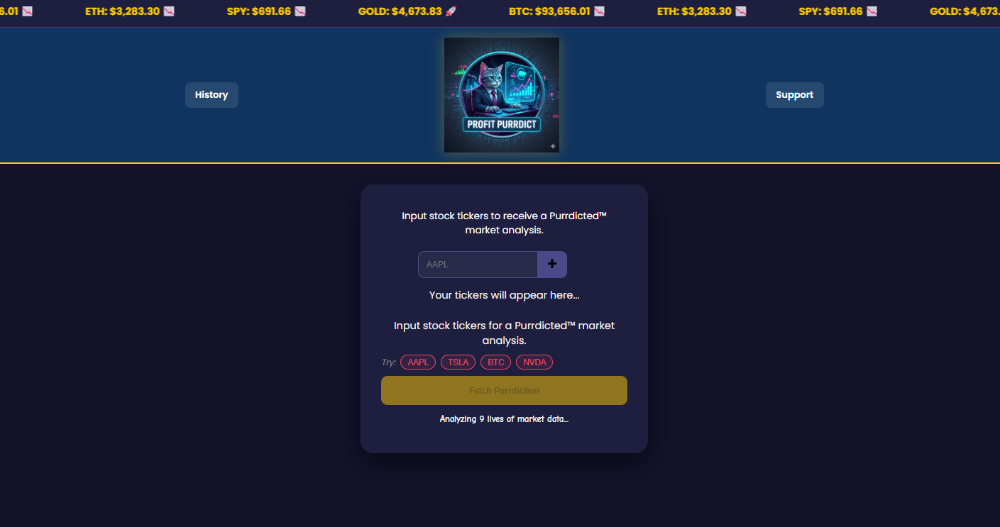

# 🐾 Purrdict Stocks | AI Financial Analysis

Purrdict is a cat-themed financial analysis tool that uses AI to provide "purrdictions" on stock market data. Built with a secure serverless architecture to keep API keys safe.




## ✨ Features

- **Real-time Market Ticker:** Live prices for BTC, ETH, SPY, and Gold.
- **AI Analysis:** Custom stock analysis powered by Google Gemini.
- **Secure Backend:** Vercel Serverless Functions protect sensitive API keys.
- **User History:** Track past "purrdictions" using LocalStorage.
- **Dynamic UI:** Interactive ticker selection with "remove" capabilities and typewriter effects.

## 🛠️ Tech Stack

- **Frontend:** HTML5, CSS3, JavaScript (ES6+)
- **Backend:** Node.js (Vercel Serverless Functions)
- **APIs:** Polygon.io (Market Data), Google Gemini (AI Analysis)

## 🚀 Local Development

1. **Clone the repo:**

   ```bash
   git clone [https://github.com/your-username/purrdict-stocks.git](https://github.com/your-username/purrdict-stocks.git)

   ```

2. Set up Environment Variables: Create a .env file in the root:

Code snippet
GEMINI_API_KEY=your_key_here
VITE_MASSIVE_API_KEY=your_polygon_key_here

3. Install Vercel CLI:

Bash
npm i -g vercel

4. Run the App:

Bash
vercel dev

🌐 Deployment (Vercel)

To deploy this project to the web:

1. Push your code to a GitHub repository.

2. Import the project into the Vercel Dashboard.

3. Important: Go to Project Settings > Environment Variables and add GEMINI_API_KEY and VITE_MASSIVE_API_KEY.

4. Deploy!

📂 Project Structure

├── api/
│ └── get-purrdiction.js # Serverless function (Backend)
├── images/ # Assets (Logos, Icons, Loader)
├── utils/
│ └── dates.js # Date formatting utility
├── index.html # Main entry point
├── index.css # Custom styling
├── index.js # Frontend logic & API calls
└── LICENSE # MIT License details

📜 License
This project is licensed under the MIT License. You are free to use, modify, and distribute this software. See the LICENSE file for more details.

---

## 👨‍💻 About the Developer

Ana Sappia Rey Building tools that make data more accessible (and a bit more fun). 

- 🌌 **Interest:** AI Integration & Secure Cloud Architecture
- 📧 **Contact:** https://www.linkedin.com/in/ana-sappia-rey/
- 🐙 **GitHub:** [@Anuska86]https://github.com/anuska86

---